<p align="center">
  <a href="https://github.com/aneeqakazmi137">
    
  </a>
</p>

<p align="center">
  
</p>

<br>

<h2 align="center">✦ About Me</h2>

<p align="center">
  <b>Software Engineering enthusiast.</b><br>
  <sub>Learning, building, and sharing code that might make someone's life a little easier.</sub>
</p>

<br><br>

<h2 align="center">✦ Tech Stack</h2>

<p align="center"><b>Languages</b></p>
<p align="center">
  
  
  
  
  
  
</p>

<p align="center"><b>Frameworks</b></p>
<p align="center">
  
  
  
  
</p>

<p align="center"><b>Databases</b></p>
<p align="center">
  
  
</p>

<p align="center"><b>Tools</b></p>
<p align="center">
  
  
  
</p>

<br><br>

<h2 align="center">✦ Featured Projects</h2>

<p align="center">
  <a href="https://github.com/aneeqakazmi137/PakFuel-Crisis-Tracker">
    
  </a>
  &nbsp;
  <a href="https://github.com/aneeqakazmi137/java-network-chat">
    
  </a>
</p>
<p align="center">
  <a href="https://github.com/aneeqakazmi137/java-pos-mysql">
    
  </a>
  &nbsp;
  <a href="https://github.com/aneeqakazmi137/modern-dev-portfolio">
    
  </a>
</p>

<br><br>

<h2 align="center">✦ GitHub Activity</h2>

<p align="center">
  
</p>

<p align="center">
  
  &nbsp;
  
</p>

<br><br>

<h2 align="center">✦ Mindset</h2>

<p align="center">
  
</p>

<p align="center">
  
</p>

<br><br>

<h2 align="center">✦ Contact</h2>

<p align="center">

```powershell
PS C:\Visitors> whoami
Aneeqa

PS C:\Visitors> status
Learning & Building

PS C:\Visitors> portfolio
github.com/aneeqakazmi137/modern-dev-portfolio

PS C:\Visitors> email
kazmianeeqai13@gmail.com
```

</p>

<p align="center">
  <a href="https://github.com/aneeqakazmi137" target="_blank">
    
  </a>
  &nbsp;
  <a href="https://modern-dev-portfolio-five.vercel.app" target="_blank">
    
  </a>
  &nbsp;
  <a href="mailto:kazmianeeqai13@gmail.com" target="_blank">
    
  </a>
</p>

<br><br>

<p align="center">
  
</p>

<br>

<p align="center">
  
</p>


